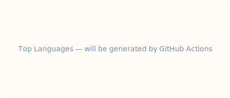
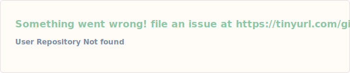

<!-- ====== TYPING HEADER ====== -->

 
 

<!-- ====== TOP LANGUAGES ====== -->

 
 

<!-- ====== CONTRIBUTION SNAKE ====== -->
<picture>
  <source media="(prefers-color-scheme: dark)" srcset="https://raw.githubusercontent.com/MINTPIPERAS/MINTPIPERAS/output/snake-dark.svg" />
  <source media="(prefers-color-scheme: light)" srcset="https://raw.githubusercontent.com/MINTPIPERAS/MINTPIPERAS/output/snake.svg" />
  
</picture>

 
 

<!-- ====== FEATURED PROJECTS ====== -->
<table>
  <tr>
    <td width="50%">
      
    </td>
    <td width="50%">
      
    </td>
  </tr>
</table>

 
 

<!-- ====== PERSONAL WEBSITE ====== -->
<h3>🏠 PIPERAS' CAVE</h3>

